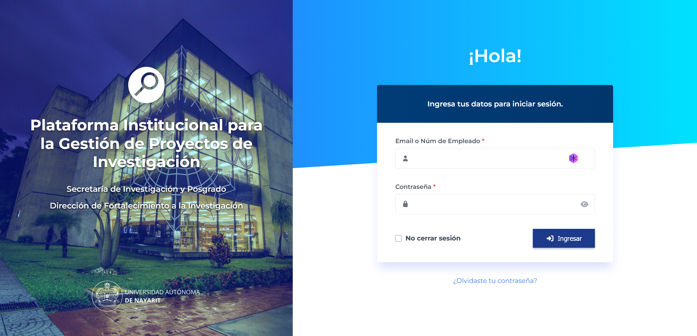

# PIIGPI - Plataforma Institucional para la Gestión de Proyectos de Investigación

Sistema web desarrollado para la **Secretaría de Investigación y Posgrado** de la **Universidad Autónoma de Nayarit**, enfocado en la gestión integral de proyectos de investigación institucionales.

## 📸 Capturas de Pantalla

### Pantalla de Login


### Panel de Proyectos


### Registro de Proyecto


## 📋 Descripción

PIIGPI es una plataforma que permite a investigadores, profesores y estudiantes gestionar el ciclo completo de proyectos de investigación, desde el registro inicial hasta el seguimiento de resultados y entregables.

### Características Principales

- **Gestión de Proyectos**: Registro, seguimiento y administración de proyectos de investigación
- **Sistema de Solicitudes**: Proceso estructurado en múltiples pasos para el registro de nuevos proyectos
- **Panel de Usuario**: Vista personalizada con filtros por estado (aprobados, en revisión, rechazados)
- **Búsqueda Avanzada**: Sistema de búsqueda y filtrado de proyectos
- **Notificaciones**: Sistema de alertas para mantener informados a los usuarios
- **Gestión de Colaboradores**: Administración de grupos de trabajo (profesores y estudiantes)
- **Cronograma de Actividades**: Planificación temporal de tareas del proyecto
- **Gestión de Entregables**: Seguimiento de productos y resultados esperados

## 🚀 Tecnologías

- **Backend**: Laravel 12.x
- **Frontend**: Blade Templates, JavaScript Vanilla
- **Estilos**: CSS3 con variables personalizadas
- **Build Tool**: Vite 7.x
- **Base de Datos**: SQLite (configurable a MySQL/PostgreSQL)
- **PHP**: ^8.2

## 📦 Requisitos Previos

- PHP >= 8.2
- Composer
- Node.js >= 18.x
- NPM o Yarn
- SQLite (o MySQL/PostgreSQL según preferencia)

## 🔧 Instalación

1. **Clonar el repositorio**
```bash
git clone <url-del-repositorio>
cd ProyectoSIP
```

2. **Instalar dependencias de PHP**
```bash
composer install
```

3. **Instalar dependencias de Node.js**
```bash
npm install
```

4. **Configurar el archivo de entorno**
```bash
cp .env.example .env
```

5. **Generar la clave de aplicación**
```bash
php artisan key:generate
```

6. **Configurar la base de datos**

Edita el archivo `.env` y configura tu conexión a la base de datos:

```env
DB_CONNECTION=sqlite
# O si usas MySQL:
# DB_CONNECTION=mysql
# DB_HOST=127.0.0.1
# DB_PORT=3306
# DB_DATABASE=piigpi
# DB_USERNAME=root
# DB_PASSWORD=
```

7. **Ejecutar migraciones**
```bash
php artisan migrate
```

8. **Compilar assets**
```bash
npm run build
```

## 🏃‍♂️ Ejecución

### Modo Desarrollo

**Opción 1: Usar el script de desarrollo integrado**
```bash
composer run dev
```
Este comando inicia automáticamente:
- Servidor Laravel (http://localhost:8000)
- Cola de trabajos
- Logs en tiempo real
- Vite dev server

**Opción 2: Comandos separados**

Terminal 1 - Servidor Laravel:
```bash
php artisan serve
```

Terminal 2 - Vite (hot reload):
```bash
npm run dev
```

### Modo Producción

```bash
npm run build
php artisan serve
```

## 📁 Estructura del Proyecto

```
ProyectoSIP/
├── app/
│   ├── Http/Controllers/    # Controladores
│   ├── Models/              # Modelos Eloquent
│   └── Providers/           # Service Providers
├── database/
│   ├── migrations/          # Migraciones de BD
│   └── seeders/            # Seeders
├── public/
│   └── rsc/                # Recursos estáticos (imágenes, logos)
├── resources/
│   ├── css/                # Estilos globales
│   │   ├── login.css      # Estilos de login
│   │   ├── main.css       # Estilos principales
│   │   └── solicitud.css  # Estilos de formularios
│   ├── js/                 # JavaScript
│   │   └── solicitud.js   # Lógica de formularios
│   └── views/              # Vistas Blade
│       ├── layouts/       # Plantillas base
│       ├── login.blade.php
│       ├── user.blade.php
│       └── solicitud.blade.php
├── routes/
│   └── web.php            # Rutas web
└── tests/                 # Tests unitarios y funcionales
```

## 🎨 Pantallas Principales

### 1. Login


Pantalla de autenticación con diseño institucional que incluye:
- Formulario de inicio de sesión con email o número de empleado
- Toggle para mostrar/ocultar contraseña
- Opción "No cerrar sesión"
- Recuperación de contraseña
- Logos institucionales (SIP y UAN)
- Diseño responsivo con panel izquierdo informativo

### 2. Panel de Usuario (Mis Proyectos)


Dashboard principal con:
- Sidebar con navegación (Proyectos, Reportes, Configuración)
- Perfil del usuario con foto y rol
- Sistema de notificaciones con badge contador
- Filtros interactivos por estado:
  - **Todos**: Muestra todos los proyectos
  - **Aprobados**: Proyectos aceptados (badge verde)
  - **En revisión**: Proyectos pendientes (badge naranja)
  - **Rechazados**: Proyectos no aprobados (badge rojo)
- Barra de búsqueda en tiempo real
- Cards de proyectos con:
  - Título y descripción
  - Fecha de registro
  - Estado visual con badge de color
  - Botón "Ver detalles"
- Paginación automática (3 proyectos por página)
- Botón "Solicitar nuevo" para crear proyectos

### 3. Registro de Proyecto (Solicitud)


Formulario multipaso con navegación lateral que incluye:

**Información General:**
1. **Responsable técnico**
   - Nombre completo
   - Programa académico (selector)
   - Máximo grado de estudios (Licenciatura/Maestría/Doctorado)
   - Pertenencia al S.N.I.

2. **Co-responsable técnico** (Protocolo de investigación)
3. **Tipo de proyecto** (Resultados de propuesta)
4. **Detalles del financiamiento**
5. **Detalles del proyecto**
   - Título
   - Objetivos
   - Metodología
   - Cronograma

6. **Entregables**
   - Contadores dinámicos para diferentes tipos de productos

7. **Grupo de trabajo**
   - Agregar profesores colaboradores
   - Agregar estudiantes participantes
   - Modales para captura de información

**Secciones Específicas:**
- Protocolo de investigación
- Resultados esperados
- Impacto de la propuesta (2 partes)
- Cronograma de actividades

**Características del formulario:**
- Indicador de progreso (X de Y pasos)
- Validación en tiempo real
- Navegación con botones "Anterior" y "Continuar"
- Campos requeridos marcados con asterisco
- Diseño responsivo y accesible

## 🎯 Funcionalidades por Desarrollar

- [ ] Sistema de autenticación completo
- [ ] CRUD de proyectos
- [ ] Sistema de roles y permisos
- [ ] Notificaciones por correo
- [ ] Generación de reportes PDF
- [ ] Dashboard de administración
- [ ] API REST
- [ ] Integración con LDAP/Active Directory

## 🧪 Testing

```bash
php artisan test
```

O usar el script de composer:
```bash
composer test
```

## 📝 Convenciones de Código

- Seguir PSR-12 para PHP
- Usar camelCase para JavaScript
- Usar kebab-case para nombres de archivos CSS
- Comentar código complejo
- Mantener componentes pequeños y reutilizables

## 🤝 Contribución

1. Fork el proyecto
2. Crea una rama para tu feature (`git checkout -b feature/AmazingFeature`)
3. Commit tus cambios (`git commit -m 'Add some AmazingFeature'`)
4. Push a la rama (`git push origin feature/AmazingFeature`)
5. Abre un Pull Request

## 📄 Licencia

Este proyecto es propiedad de la **Universidad Autónoma de Nayarit** y está bajo una licencia institucional.

## 👥 Contacto

**Secretaría de Investigación y Posgrado**  
**Dirección de Fortalecimiento a la Investigación**  
Universidad Autónoma de Nayarit

---

Desarrollado con ❤️ para la comunidad académica de la UAN
